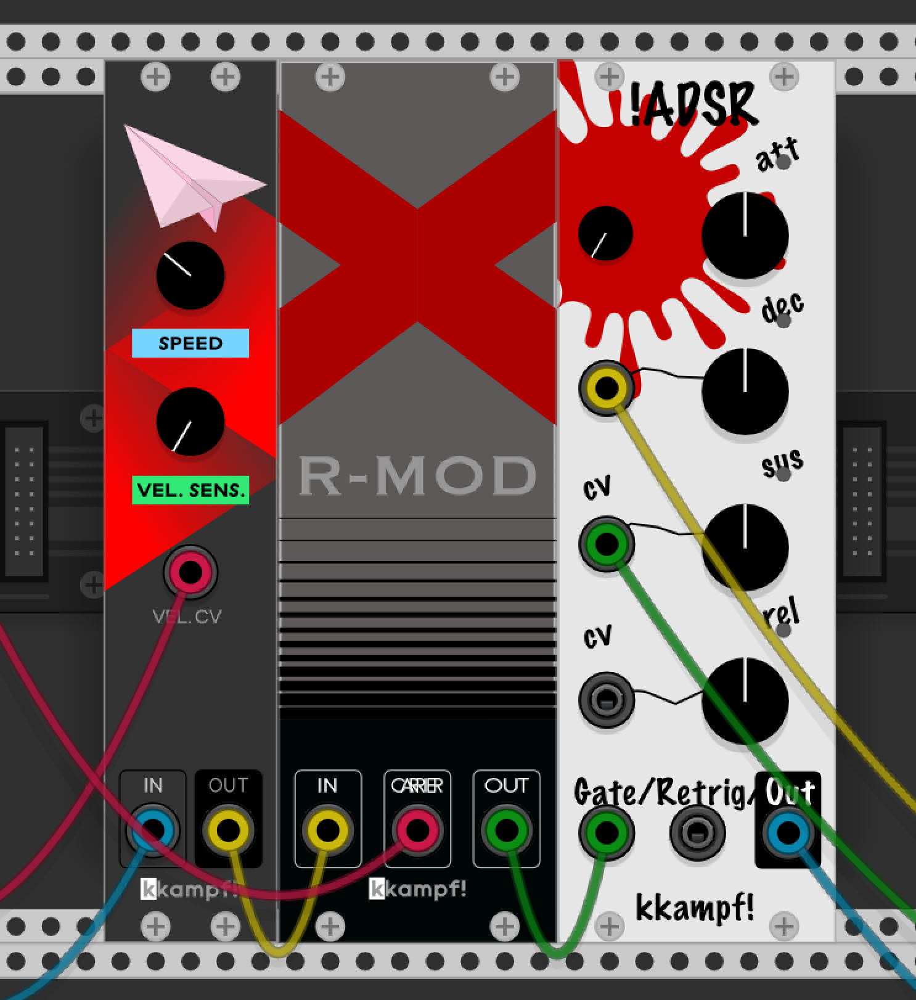

## VCV KKampf

A series of small utility [VCV Rack](https://vcvrack.com/) modules created for educational and entertainment purposes. The list of modules, available within this
 plugin will be hopefully, expanded in the future.

### Modules
#### HK-1. Glider
So, this is my first custom VCV rack module and, coincidentally, first ever attempt at DSP. Glider provides a “portamento glide” effect to
 pitch CVs, similar to ones  you’ll find in monophonic synths. Out CV will be smoothed linearly between the steps , the single knob controls the
  speed. 

#### HK-2. R-Mod
Simple [ringmodulator](https://en.wikipedia.org/wiki/Ring_modulation) with some very primitive output saturation, as ring modulation product
 can go sufficiently beyond VCV Rack's voltage
 standards.
 
#### HK-3. HADSR 
Well. That's an odd one. With me really wanting to add a simple drum machine swing to my sequences, and not coming up with anything better than
 manually delaying the off-beats. I purposely made it look like a
 badly modded original
 ADSR Fundamental module. 

### Building
##### 1. Prerequisites
1. Build essentials for your OS
1. Install [VCV Rack](https://vcvrack.com/)
2. Download the latest [Rack SDK](https://vcvrack.com/downloads/) and extract it. This contains the Rack API headers and build system for
 compiling your plugin
3. `export RACK_DIR=<Rack SDK folder>`

##### 2. Build
```bash
git clone git@github.com:deviant-syndrome/kkampf.git
cd kkampf
make
make install
```

NOTE: this build instructions are rather brief and condensed. For a more elaborate guide please visit: https://vcvrack.com/manual/PluginDevelopmentTutorial

##### Acknowledgements:  
* A vector artwork of paper airplanes from [FreeVector]("https://www.freevector.com/paper-airplanes-19260#") was used in HK-1 GUI 
* GEOMETRIC SANS SERIF V1 REGULAR font by by Roman Gornitsky Moscow, Russland http://abstrkt.ru/ was used to make module’s GUI. 
* Trueno font by [Julieta Ulanovsky](http://www.zkysky.com.ar/) was used to make module’s GUI.
